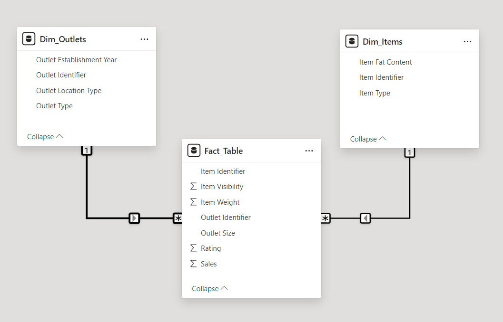

# BlinkIt Data Analysis

A comprehensive analysis of Blinkit's sales performance, customer satisfaction, and inventory distribution to identify key insights and opportunities for optimization using various KPIs and visualizations in Power BI.

## Table of Contents

- [Background](#background)
- [Business Requirement](#business-requirement)
- [KPI's Requirements](#kpis-requirements)
- [Chart's Requirements](#charts-requirements)
- [Data Discovery](#data-discovery)
- [Data Analysis using MySQL](#data-analysis-using-mysql)
- [Data Cleaning and ETL](#data-cleaning-and-etl)
- [Data Modeling](#data-modeling)
- [Data Analysis using DAX](#data-analysis-using-dax)
- [Dashboard](#dashboard)
- [Tools, Software and Libraries](#tools-software-and-libraries)

## Background

This project aims to comprehensively analyze Blinkit's sales performance, customer satisfaction, and inventory distribution to identify key insights and opportunities for optimization.

## Business Requirement

To conduct a comprehensive analysis of Blinkit's sales performance, customer satisfaction, and inventory distribution to identify key insights and opportunities for optimization using various KPIs and visualizations in Power BI.

## KPI's Requirements

1. Total Sales: The overall revenue generated from all items sold.
2. Average Sales: The average revenue per sale.
3. Number of Items: The total count of different items sold.
4. Average Rating: The average customer rating for items sold.

## Chart's Requirements

1. Total Sales by Fat Content:
	* Objective: Analyse the impact of fat content on total sales.
	* Additional KPI Metrics: Assess how other KPIs (Average Sales, Number of Items, Average Rating) vary with fat content.
	* Chart Type: Donut Chart.
2. Total Sales by Item Type:
	* Objective: Identify the performance of different item types regarding total sales.
	* Additional KPI Metrics: Assess how other KPIs (Average Sales, Number of Items, Average Rating) vary with fat content.
	* Chart Type: Bar Chart.
3. Fat Content by Outlet for Total Sales:
	* Objective: Compare total sales across different outlets segmented by fat content.
	* Additional KPI Metrics: Assess how other KPIs (Average Sales, Number of Items, Average Rating) vary with fat content.
	* Chart Type: Stacked Column Chart.
4. Total Sales by Outlet Establishment:
	* Objective: Evaluate how the age or type of outlet establishment influences total sales.
	* Chart Type: Line Chart.
5. Sales by Outlet Size:
	* Objective: Analyse the correlation between outlet size and total sales.
	* Chart Type: Donut/ Pie Chart.
6. Sales by Outlet Location:
	* Objective: Assess the geographic distribution of sales across different locations.
	* Chart Type: Funnel Map.
7. All Metrics by Outlet Type:
	* Objective: Provide a comprehensive view of all key metrics (Total Sales, Average Sales, Number of Items, Average Rating) broken down by different outlet types.
	* Chart Type: Matrix Card.

## Data Discovery

Project planning using AIMS Grid:

1. Purpose: To unlock sales insights that were not visible before for the sales team for decision support and automate them to reduce manual time spent in data gathering.
2. Stakeholders:
	* Sales Director
	* Marketing Team
	* Customer Service Team
	* Data and Analytics Team
	* IT
3. result: An automated dashboard providing quick and latest sights to support Data-driven decision-making.
4. Success Criteria:
	* Dashboard uncovering sales order insights with the latest data available
	* The sales team can make better data-driven decisions.
	* Sales Analysts stop data gathering manually to save business time.

## Data Analysis using MySQL

1. Show all sales records:  `select * from blinkit_sales;`
2. Show Total Sales:   `select sum(sales) as total_sales from blinkit_sales;`
3. Show Average Sales:  `select avg(sales) as average_sales from blinkit_sales;`
4. Show Average Rating:  `select avg(rating) as average_rating from blinkit_sales;`
5. Show Number of Items:  `select count(*) as number_of_items from blinkit_sales;`
6. Show total sales according to outlet size:  `select outlet_size, round(sum(sales),2) as sales from blinkit_sales group by Outlet_Size`

## Data Cleaning and ETL(Extract, Transform, Load)

Our data is initially extracted from the CSV file into Power BI, and then the subsequent Extract, Transform, and Load (ETL) is executed in Power Query:

### 1. Referencing Raw Data
Create three new queries namely Fact_Table, Dim_Items, and Dim_Outlets.

### 2. Removed unwanted columns
Removed unwanted columns in Fact_Table, The following columns were removed:

* Item Fat Content
* Item Type
* Outlet Establishment Year
* Outlet Location Type
* Outlet Type

### 3. Removed unwanted columns from Dim_Outlets
Removed unwanted columns from Dim_Outlets using the remove other columns feature. Resulted Table Includes the following columns:

* Outlet Identifier
* Outlet Establishment Year
* Outlet Location Type
* Outlet Type

### 4. Replaced inconsistent values in Dim_Items Table
Replaced inconsistent values in Dim_Items Table, Item Fat Content Column:
* Replaced LF with Low Fat
* Replaced reg with Regular

### 5. Removed unwanted columns from Dim_Outlets
Removed unwanted columns from Dim_Outlets using the remove other columns feature. Resulted Table Includes the following columns:
* Item Identifier
* Item Fat Content
* Item Type

This concluded the ETL process, and after that, we modeled data into star schema in the next step.

## Data Modeling
To improve measure performance and reduce visual query time star schema is built from a flat file.
With relationships as follows:

## Data Analysis using DAX
Some of the measures done using DAX are:

### 1. Total Sales  = SUM(Fact_Table[Sales])
### 2. Average Sales = AVERAGE(Fact_Table[Sales])
### 3. Average Rating = AVERAGE(Fact_Table[Rating])
### 4. Number of Items = COUNTROWS(Fact_Table)
### 5. Total SKUs = COUNTROWS(Dim_Items)

## Dashboard

## Tools, Software and Libraries
### 1. MySQL
### 2. Microsoft Power BI
### 3. Power Query
